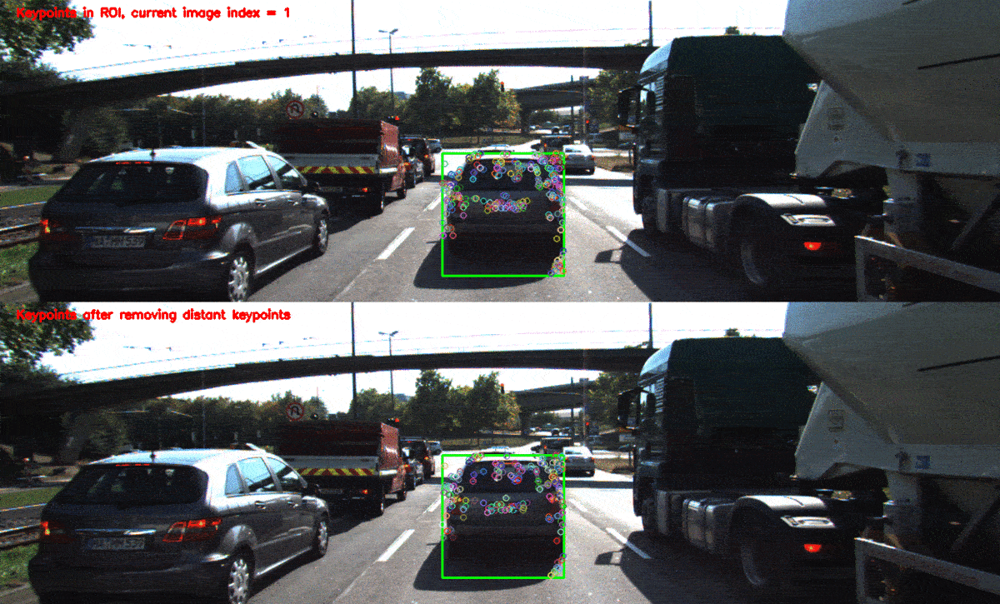
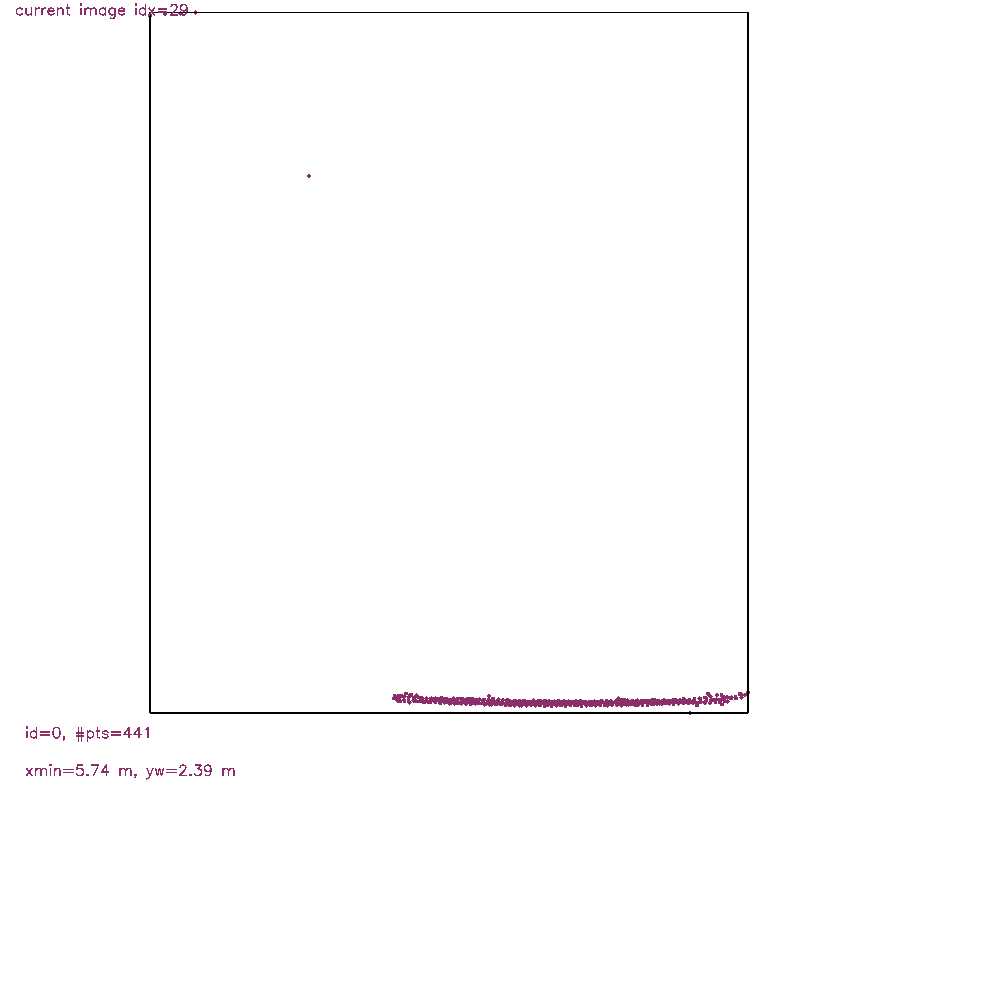
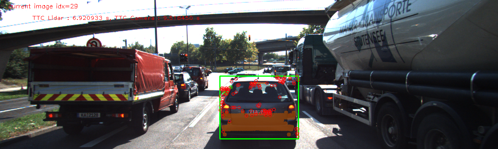
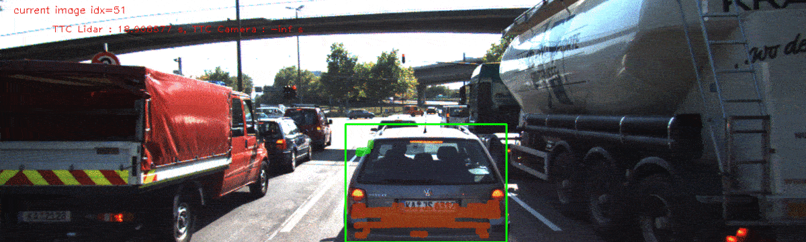
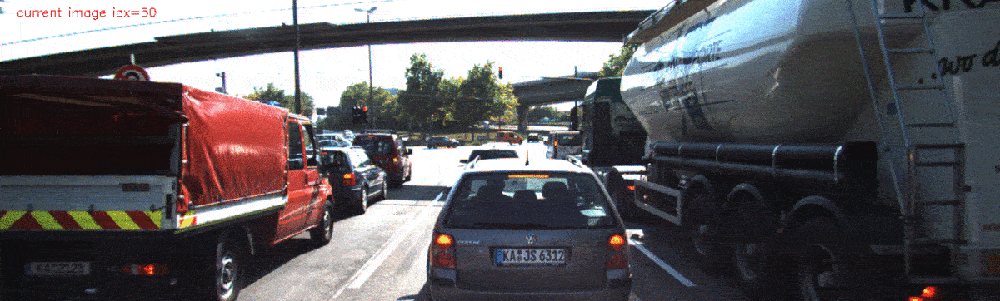
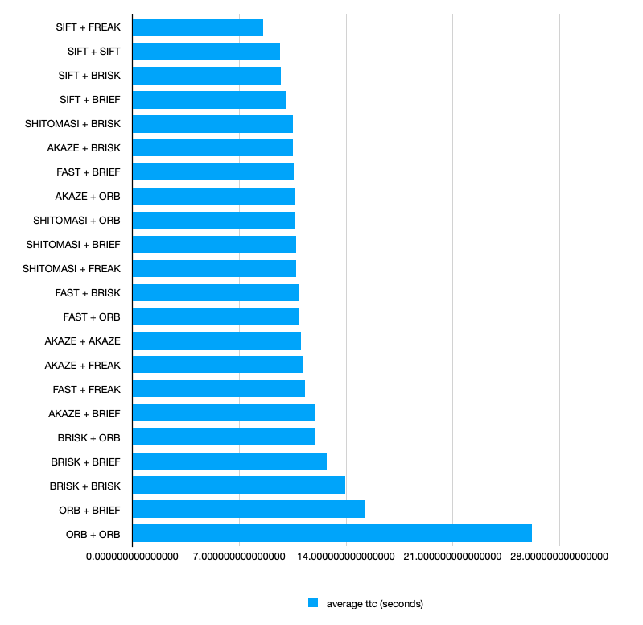
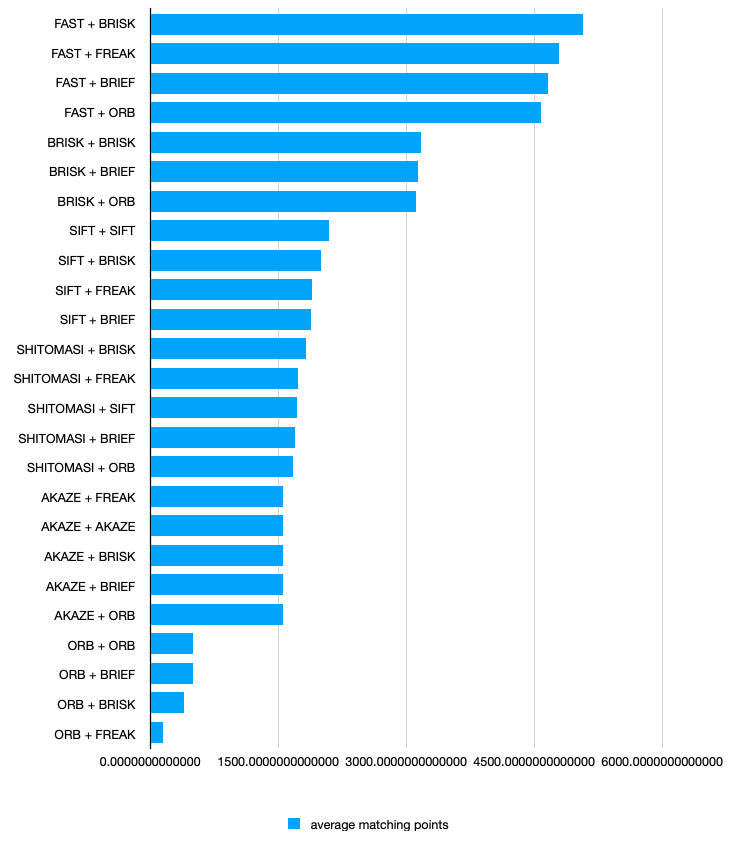
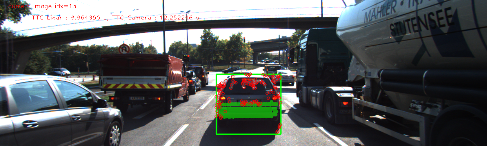
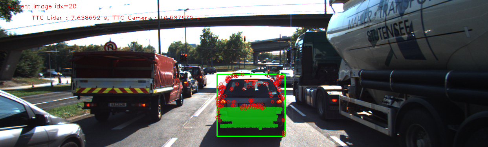

# SFND 3D Object Tracking

Welcome to the final project of the camera course. By completing all the lessons, you now have a solid understanding of keypoint detectors, descriptors, and methods to match them between successive images. Also, you know how to detect objects in an image using the YOLO deep-learning framework. And finally, you know how to associate regions in a camera image with Lidar points in 3D space. Let's take a look at our program schematic to see what we already have accomplished and what's still missing.

In this final project, you will implement the missing parts in the schematic. To do this, you will complete four major tasks: 
1. First, you will develop a way to match 3D objects over time by using keypoint correspondences. 
2. Second, you will compute the TTC based on Lidar measurements. 
3. You will then proceed to do the same using the camera, which requires to first associate keypoint matches to regions of interest and then to compute the TTC based on those matches. 
4. And lastly, you will conduct various tests with the framework. Your goal is to identify the most suitable detector/descriptor combination for TTC estimation and also to search for problems that can lead to faulty measurements by the camera or Lidar sensor. In the last course of this Nanodegree, you will learn about the Kalman filter, which is a great way to combine the two independent TTC measurements into an improved version which is much more reliable than a single sensor alone can be. But before we think about such things, let us focus on your final project in the camera course. 

## Dependencies for Running Locally
* cmake >= 2.8
  * All OSes: [click here for installation instructions](https://cmake.org/install/)
* make >= 4.1 (Linux, Mac), 3.81 (Windows)
  * Linux: make is installed by default on most Linux distros
  * Mac: [install Xcode command line tools to get make](https://developer.apple.com/xcode/features/)
  * Windows: [Click here for installation instructions](http://gnuwin32.sourceforge.net/packages/make.htm)
* Git LFS
  * Weight files are handled using [LFS](https://git-lfs.github.com/)
* OpenCV >= 4.1
  * This must be compiled from source using the `-D OPENCV_ENABLE_NONFREE=ON` cmake flag for testing the SIFT and SURF detectors.
  * The OpenCV 4.1.0 source code can be found [here](https://github.com/opencv/opencv/tree/4.1.0)
* gcc/g++ >= 5.4
  * Linux: gcc / g++ is installed by default on most Linux distros
  * Mac: same deal as make - [install Xcode command line tools](https://developer.apple.com/xcode/features/)
  * Windows: recommend using [MinGW](http://www.mingw.org/)

## Basic Build Instructions

1. Clone this repo.
2. Make a build directory in the top level project directory: `mkdir build && cd build`
3. Compile: `cmake .. && make`
4. Run it: `./3D_object_tracking`.

## FP.1 : Match 3D Objects

For this a "Bounding Box Combination Score" matrix is created in which the row numbers correspond to the bounding box index for the current frame and columns correspond to the bounding box index for the previous frame. matchBoundingBoxes function iterates over the keypoint matches. For each key point match, the bounding box index is found in current and previous frame and the score of corresponding cell in the "Bounding Box Combination Score" matrix is incremented by 1. 

matchBoundingBoxes function then iterates over "Bounding Box Combination Score" matrix by row and selects the column which has maximum score. In case multiple columns have same score, none of them are selected. The row and column number are then updated into the bbBestMatches.

Following figure shows the working of matchBoundingBoxes

## FP.2 : Compute Lidar-based TTC

Lidar based TTC has been computed using the median value of the Lidar cluster. Taking median value helps in discarding the outliers. The result for Lidar-based TTC can be seen in FP.6

## FP.3 : Associate Keypoint Correspondances with Bounding Boxes

clusterKptMatchesWithROI functions iterates over the keypoint matches corresponding to the bounding box and if the current keypoints are inside the roi of the current bounding box and if the distance of the current keypoint and it's corresponding previous keypoint is less than the threshold(dependent on mean of distances of current and previous keypoints) then those matches and current keypoints are added to the bounding box.

Following figure show the working of clusterKptMatchesWithROI. The upper image show the keypoints in the roi of bounding box. The lower image shows the keypoints once the keypoints whose distance is greater than the threshold limit have been removed.

## FP.4 : Compute Camera-based TTC

computTTCCamera function obtains vector of distance ratio of keypoint pairs in current and previous image frame. It obtains the median of distance ratios and then uses it to compute TTC. Using median of distance ratio helps in obtaining statistically robust TTC. The result for Camera-based TTC can be seen in FP.6

## FP.5 : Performance Evaluation 1

This section shows the cases where Lidar-based TTC seems off when compared to the hand calculated TTC value from the top view of lidar points

(1) Case 1: Image Index 29. 

<table>
  <thead>
    <tr>
      <td>Image Index</td>
      <td>Lidar min-x Curr</td>
      <td>Lidar min-x Prev</td>
      <td>Lidar median-x Curr</td>
      <td>TTC using x-min(s)</td>
      <td>TTC usign x-median(s)</td>
      <td>TTC Camera(s)
    </tr>
  <thead>
  <tbody>
    <tr>
      <td>5.738</td><td>5.954</td><td>5.952</td><td>6.038</td><td>2.656</td><td>6.921</td><td>9.518</td>
    </tr>
  </tbody>
</table>

Fig FP.5.1 : Lidar Top View for image Index 29

Fig FP.5.3 : Lidar Points projected Camera Image for image index 29

Hand calculated Lidar TTC value for image index is 2.656s which is way less than the Lidar TTC estimate which is 6.921s.
The min-x lidar value in this case for x = 5.74 m. This point is away from the major cluster of the lidar points. On looking at the image in FP.5.3 it seems like this could be coming from tailpipe of the car, which has become visible as the ego-car has moved close to it. 
The Lidar-based estimate for TTC is based on the median value of x value of Lidar points. Thus the hand calculated TTC and Estiamted TTC don't match.

(2) Case 2 : Image index 51 onwards(ego car and car-in-front at standstill)

Image index 51 onwards both ego-car and the car-in-front are at standstill. The expected value of Lidar-based TTC should be zero. However it keeps changing as shown below:

Fig FP.5.4 : Lidar-based TTC changing when car-in-front and ego-car are at standstill

The reason for this behavior is that the Lidar Points corresponding to the front car are changing, which caused the median x value for the Lidar Points to change. The physical reason is that the car in front has the reflections of the traffic from right lande. As this reflection changes the Lidar Points as received by receiver changes.

In the following figure the reflection from the right lane traffic on car-in-front can be seen.

## FP.6 Performance Evaluation 2

* FP.6.1 Peformance of various detector/descriptor combinations

<a href="./reports/TTCForDetectorDescriptorCombinations.pdf">PDF Report on TTC for various Detector Descriptor Combinations</a>.

Snapshot showing average TTC for various Detector Descriptor combinations is as follows:(the TTCs upto frame 50 have been used, as after that the vehicle comes to standstill and the TTC value goes to infinity)

 
Note that AKAZE Descriptor does not work with other detectors.

Snaphot showing average number of matching points for various Detector Descriptor combinations is as follows:

* FP.6.2 Examples where Camera-based TTC estimation is way off

Fig 6.2.1 : Lidar and Camera based TTC Estimation for complete run

Image index 51 onwards, Camera-based TTC Estimate is at infinity which is as expected as the ego-car and car-in-front are at standstill

There are several cases where the Camera-based TTC estimated is way higher than the Lidar-based TTC estimated. Consider the image indices 13 and 20.

Fig FP.6.2.2 : Image Index = 13, Lidar-based TTC Estimate = 9.96s, Camera-based TTC Estimate = 12.25s

Fig FP.6.2.3 : Image Index = 20, Lidar-based TTC Estimate = 7.64s, Camera-based TTC Estimate = 10.59s"

One of the reasons for this behavior is that several keypoints are located in the top-right corner of the bounding box but outside the edge of the car-in-front. There is another car in the that corner and the keypoints are corresponding to that car. This is setting off the Camera-based TTC Estimate.